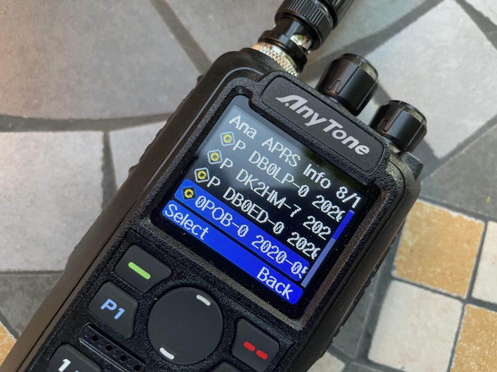
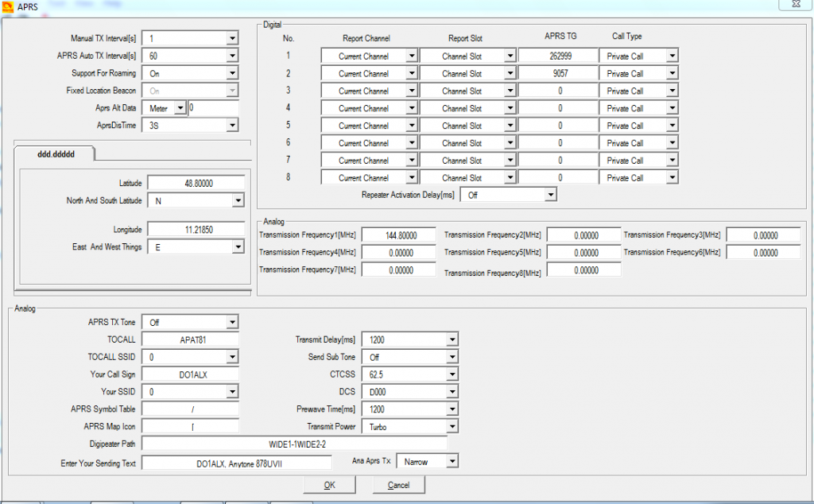
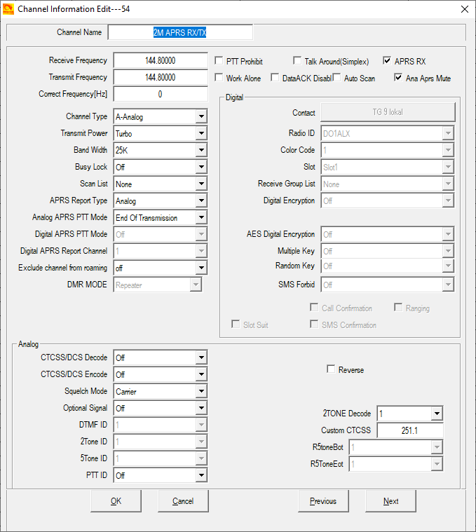

# Anytone AT-D878UV APRS Repository

          
          

APRS Manuals:
- [DO1ALX](https://do1alx.de/2021/getting-analog-aprs-to-work-on-an-anytone-at-878uv-and-at-878uvii/)
- [M0PQA](https://www.m0pqa.com/2020/05/making-aprs-work-on-anytone-at-d878uv.html)

APRS Video Tutorials:
- [W3AMG](https://www.youtube.com/watch?v=x3I-FKaE1ZU)
- [N1NUG](https://www.youtube.com/watch?v=Kvjbw1QNxpA)
- [AC3DS](https://www.youtube.com/watch?v=RfjIa7zu0Mg)
- [KE0OG](https://www.youtube.com/watch?v=MjnmOmSdqVU)
- [KB6VTU](https://www.youtube.com/watch?v=ObsXEYypyl0)
- [N6DMR](https://www.youtube.com/watch?v=gohiZ4or81s)
